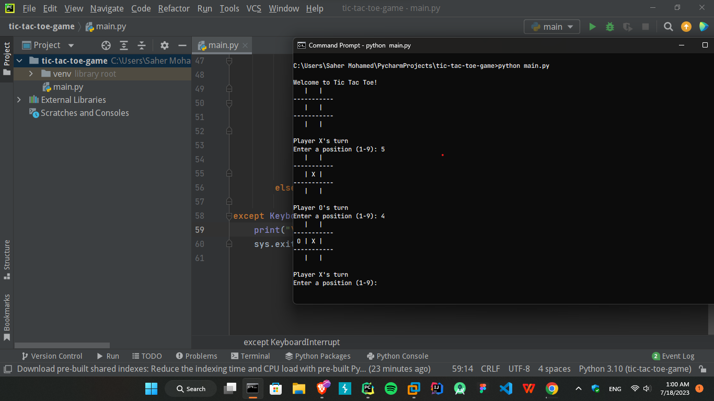
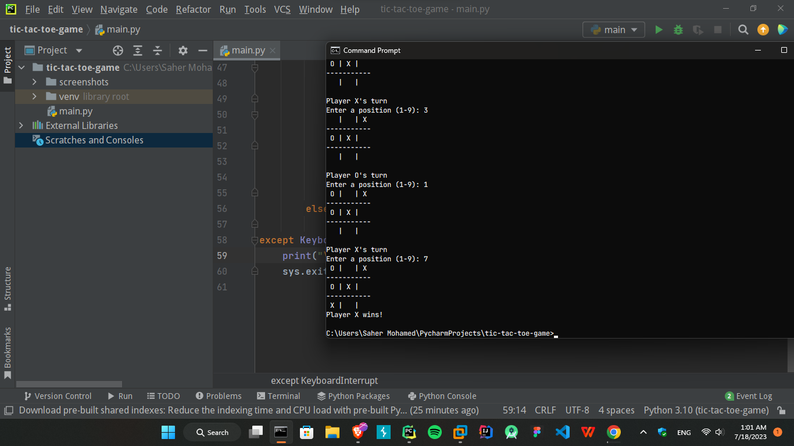

# Tic Tac Toe
This is a simple command-line implementation of the classic game Tic Tac Toe using Python.

## How to Play
1. Run the script using python `main.py`.
2. The game will start, and an empty Tic Tac Toe board will be displayed.
3. The players take turns entering their moves.
4. Player 1 `X` goes first, followed by player 2 `O`.
5. Enter a position on the board by providing a number from 1 to 9 when prompted.
6. The positions on the board are numbered as follows:
   ```text
    1 | 2 | 3 
   -----------
    4 | 5 | 6 
   -----------
    7 | 8 | 9 
   ```

## Features
- The game will continue until one player wins or there is a tie.
- If a player wins, the game will display the winner.
- If the game ends in a tie, it will be indicated as well.
- To terminate the game at any time, `press Ctrl + C`.

**Have fun playing Tic Tac Toe!**

## Screenshots


